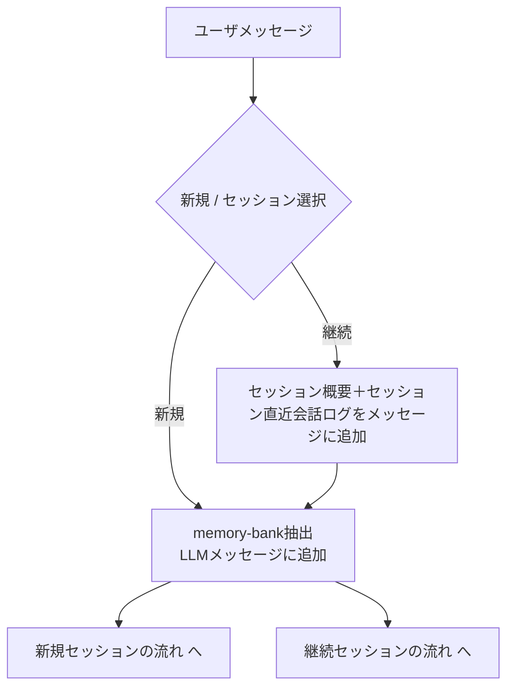
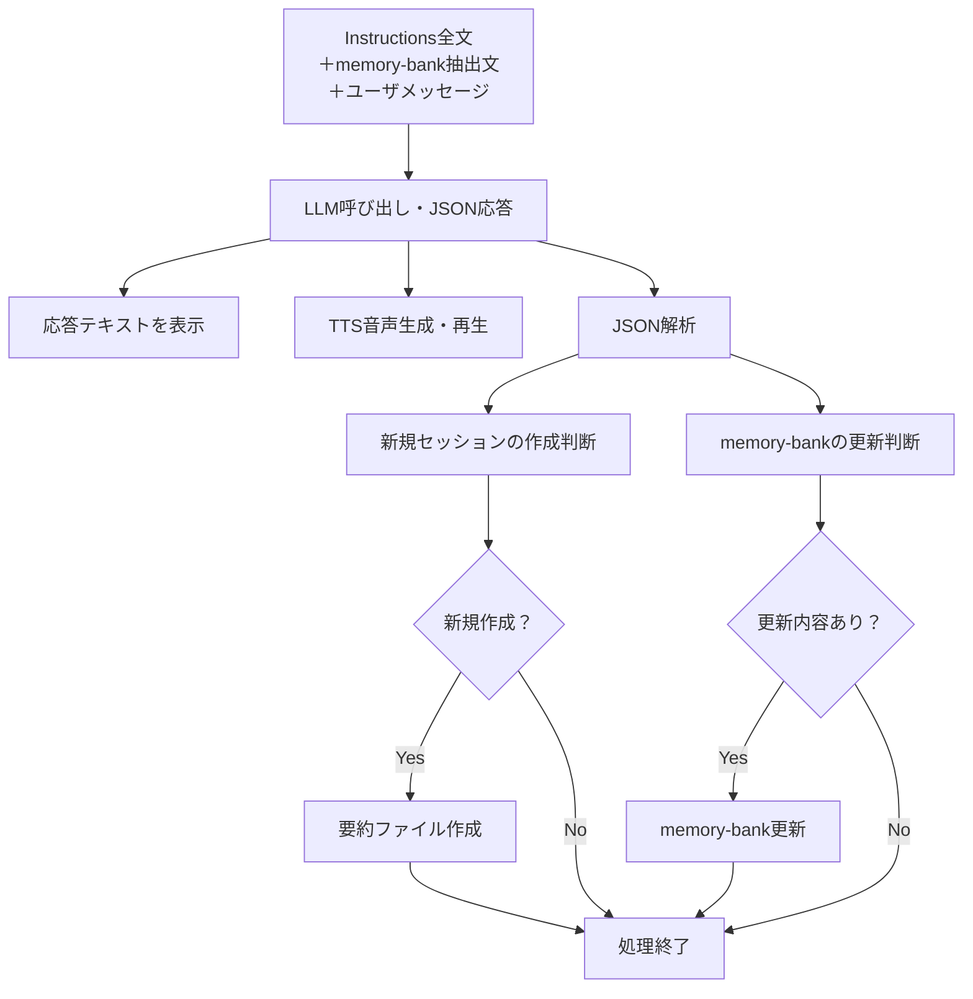
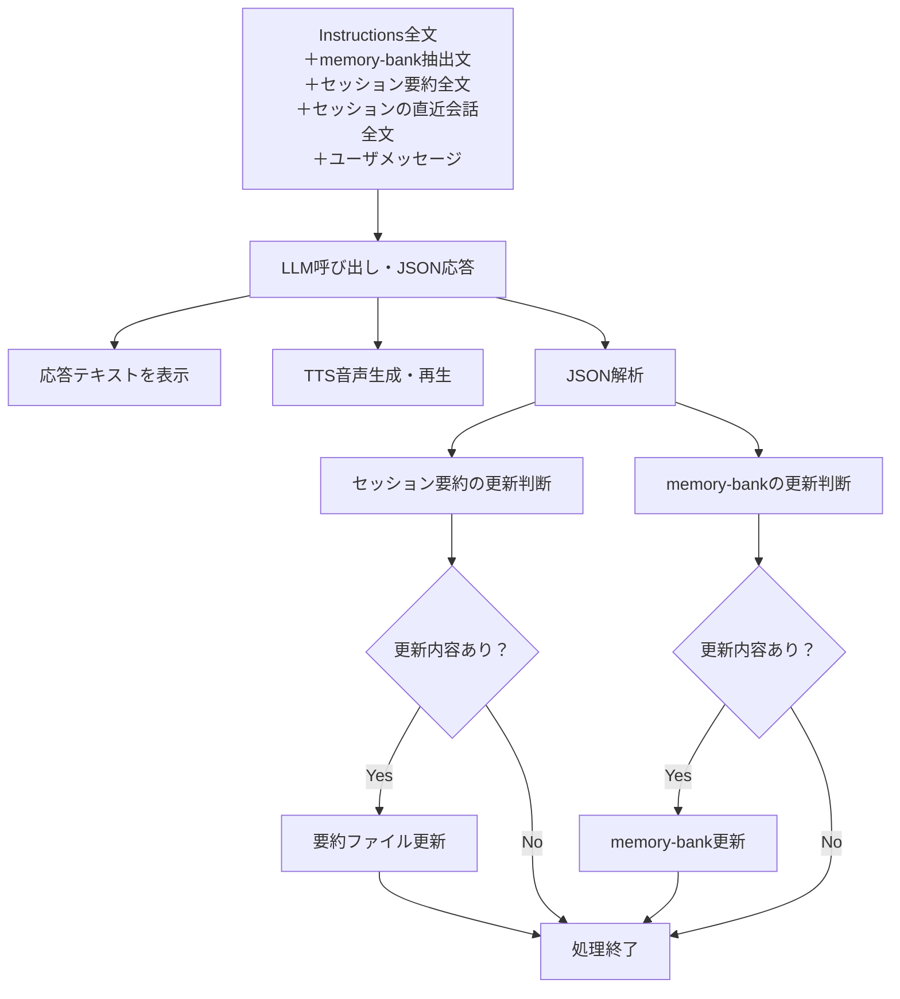

## Memo

* LLMはOpenRouter
* memory-bankは当面単一mdに、個人情報・好み・その他セッションによらず記憶すべきことを記載
* セッションの保存先はローカルファイルフォルダ。最大10セッション

## Flow

### ユーザ入力を受けたときの最初 (セッションは自動判断)

```mermaid
flowchart TD
    A[ユーザメッセージ]
    A --> B{新規 / セッション選択}
    B -- 新規 --> X[memory-bank抽出
    LLMメッセージに追加]
    X --> C[新規セッションの流れ へ]
    B -- 継続 --> D[セッション概要＋セッション直近会話ログをメッセージに追加]
    D --> X
    X --> E[継続セッションの流れ へ]
```

### 新規セッションの流れ

```mermaid
flowchart TD
    A[Instructions全文
    ＋memory-bank抽出文
    ＋ユーザメッセージ]
    A --> C[LLM呼び出し・JSON応答]
    C --> D[応答テキストを表示]
    C --> E[TTS音声生成・再生]
    C --> F[JSON解析]

    F --> G[新規セッションの作成判断]
    F --> H[memory-bankの更新判断]

    G --> I{新規作成？}
    H --> J{更新内容あり？}

    I -- Yes --> K[要約ファイル作成]
    J -- Yes --> L[memory-bank更新]
    I -- No --> O
    J -- No --> O

    K --> O[処理終了]
    L --> O
```

### 継続セッションの流れ

```mermaid
flowchart TD
    A[Instructions全文
    ＋memory-bank抽出文
    ＋セッション要約全文
    ＋セッションの直近会話全文
    ＋ユーザメッセージ]
    A --> C[LLM呼び出し・JSON応答]
    C --> D[応答テキストを表示]
    C --> E[TTS音声生成・再生]
    C --> F[JSON解析]

    F --> G[セッション要約の更新判断]
    F --> H[memory-bankの更新判断]

    G --> I{更新内容あり？}
    H --> J{更新内容あり？}

    I -- Yes --> K[要約ファイル更新]
    J -- Yes --> L[memory-bank更新]
    I -- No --> O
    J -- No --> O

    K --> O[処理終了]
    L --> O
```